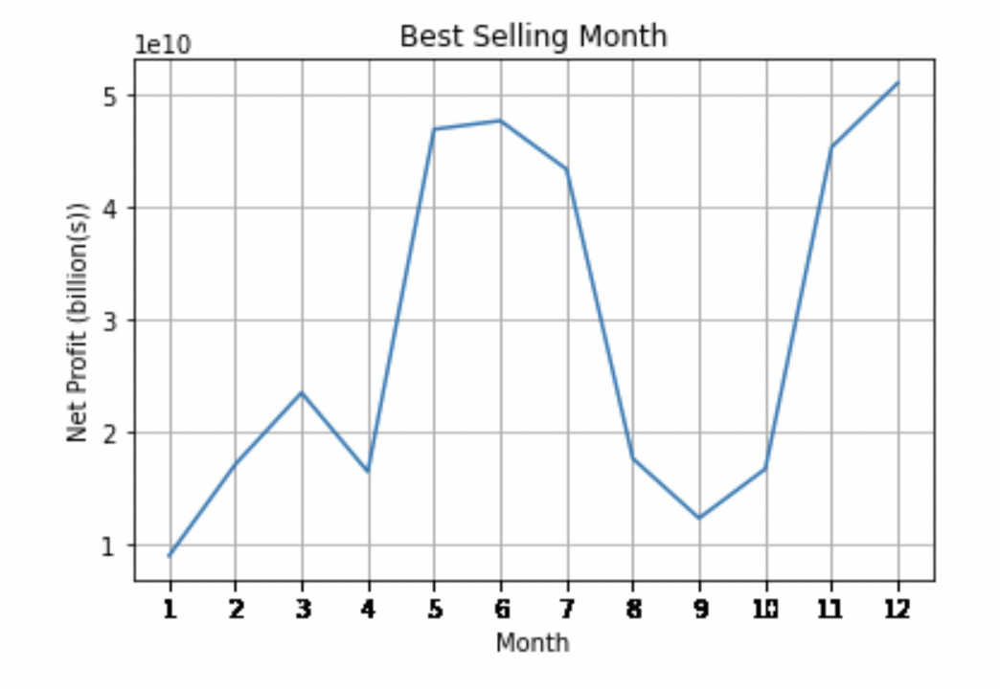
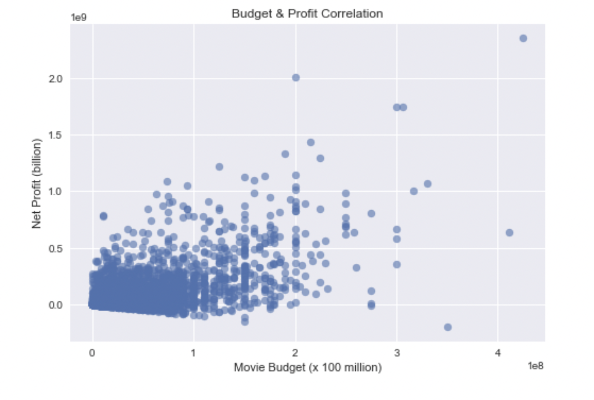

# Phase 1 Project: Movie Data Analysis

Author: Kregg Jackson

## Project Overview

For this project I used exploratory data analysis to generate insights for a business stakeholder.

## Business Problem

Microsoft sees all the big companies creating original video content and they want to get in on the fun. They have decided to create a new movie studio, but they don’t know anything about creating movies. I am charged with exploring what types of films are currently doing the best at the box office. 

## The Data

In the folder `zippedData` are movie datasets from:

* [Box Office Mojo](https://www.boxofficemojo.com/)
* [IMDB](https://www.imdb.com/)
* [Rotten Tomatoes](https://www.rottentomatoes.com/)
* [TheMovieDB](https://www.themoviedb.org/)
* [The Numbers](https://www.the-numbers.com/)

## Methods

I used descriptive analysis while testing and examining the data. The tests showed the best release window by determining what time of the year movies tend to sell the best. Then I tested the correlation of production budgets and global gross to see if a larger budget increases the likelihood of a high grossing film. I also grouped together data frames in order to find the studios that make the most per movie.

## Results

### Task 1: Find when highest selling movies are released.

According to the peaks in sales in December, November, and June it can be derived that these months are the best time for movie sales. 

### Task 2: Find how much the budget is related to gross.

The scatterplot shows a positive correlation between budget and global gross. I advise the more you invest in the film budget the higher chance of a high grossing film.

### Task 3: Find the most effective film studios.

These are the 20 studios who made the most per film. If this is the company's first time producing a movie I would recommend collaborating with one of the studios who have shown an ability to produce high earning films.

## Conclusions

The projects results led to these suggestions for releasing a successful movie.

* December, November, and June are the best months for movie sales
* Worldwide gross and movie budget are positively correlated and a higher budget often translates in a higher grossing movie
* The studios who gross the most per film might be a valuable partner in a movie collaboration

### Next Steps

Additional analysis could provide further insights into how to improve likelihood of box office success.

* Could help to add more movie data. I am assuming the studio is willing to invest heavily in their debut film so more data on high grossing films could help pinpoint characteristics of successful films.
* Add more genre data because there is only one genre column. More genre information could help lead to detailed characteristics of the best selling genres.
* With more time the ratings data could be further analyzed. Analysts could calculate how much ratings correlate with profit and find what factors lead to a high rated movie.

## For More Information
See the full analysis in the [Jupyter Notebook](https://github.com/kreggthegoat/dsc-phase-1-project/blob/master/student.ipynb) or review this [presentation](https://docs.google.com/presentation/d/1Jxtx3qvEq3NeAXZVPLzfDYQ962m-yy5PtHfMnq8Qr44/edit?usp=sharing). 

## Thank you